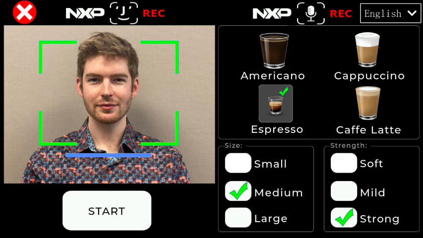
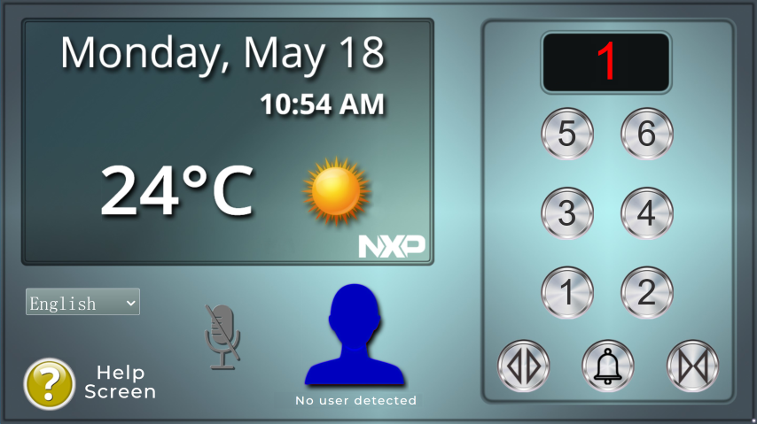
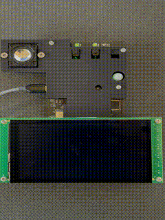
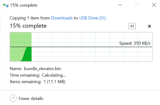
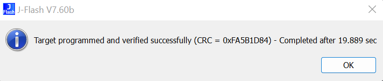

# Introduction

This project contains all the source code for [NXP's Smart HMI solution](www.nxp.com/mcu-smhmi).
For information about getting up and running with the Smart HMI solution, check out the [Smart HMI Getting Started Guide].

## Out-of-Box Demos

The Smart HMI Solution comes with a few different demo applications flashed right out of the box.
These applications include the [Coffee Machine](#coffee-machine), [Elevator](#elevator), and [Smart Home Panel](#smart-home-control-panel) demo applications,
with new functionality and demos being added in as part of update releases.

Each of these apps are intended to demonstrate and highlight different functionality that the solution supports,
while providing a software reference design and boilerplate code to accelerate development of your own applications.

### Coffee Machine

This demo shows how a hypothetical smart countertop appliance like a coffee machine might utilize features like:

- Multilingual hands-free voice control
- Face recognition

A detailed description of the Coffee Machine demo, including the features it supports and their usage, can be found in the [Smart HMI User Guide].

#### Source Code

The source code for the Coffee Machine out-of-box demo application can be found under the `coffee_machine` folder.

By default, the firmware for the Coffee Machine application is located at `0x30100000`, while the resource files (images, audio files, etc.) are located at `0x30700000`.

### Elevator

The Elevator demo application is one of several different applications supported out-of-the-box by the Smart HMI Solution.

This demo shows how a hypothetical "smart building" application like an elevator might utilize features like:

- Multilingual hands-free voice control
- Face recognition

A detailed description of the Elevator demo, including the features it supports and their usage, can be found in the [Smart HMI User Guide].

#### Source Code

The source code for the Elevator out-of-box demo application can be found under the `elevator` folder.

By default, the firmware for the Elevator application is located at `0x31500000`, while the resource files (images, audio files, etc.) are located at `0x31B00000`.

### Smart Home Control Panel

> **Note**
> The Smart Home Control Panel demo is currently in development
> and will be made available in a future release.

The Smart Home Control Panel demo application is one of several different applications supported out-of-the-box by the Smart HMI Solution.

This demo shows how a hypothetical smart home appliance like a wall control panel might utilize features like:

- Multilingual hands-free voice control
- Face recognition w/ liveness detection & antispoofing protection
- Gesture recognition

A detailed description of the Smart Home Control Panel demo, including the features it supports and their usage, will be made available in the [Smart HMI User Guide] once the demo is released.

#### Source Code

Once ready, the source code for the Smart Home Control Panel out-of-box demo application will be made available under the `smart_home` folder once the demo is released.

By default, the firmware for the Smart Home Control Panel application is located at `0x32900000`, while the resource files (images, audio files, etc.) are located at `0x32F00000`.

## Bootloader

The Smart HMI solution utilizes a multi-stage boot process to enable additional security features, update mechanisms, and more.
As part of this multi-stage boot process, the out-of-box firmware uses a bootloader project which is responsible for,
among other things,

- Selecting which application to run based on the button held during boot
- Enabling [Mass Storage Device (MSD) Drag-and-Drop](#mass-storage-device-msd-drag-and-drop-updates) updates

The source code for the bootloader application can be found under the `bootloader` folder.
By default, the firmware for the bootloader project is located at `0x30000000`.

Additional details regarding the bootloader and the features it supports can be found in the [Smart HMI Software Developer Guide].

## Framework

The Smart HMI Solution makes use of NXP's "Framework Architecture" which is designed to accelerate development by:

- Reducing the amount of tightly coupled code that exists in each of the projects
- Allow for code reuse among different projects and platforms by making use of a Hardware Abstraction Layer (HAL)
- Enabling easier communication between cores in multi-core projects

More details regarding the Framework architecture, including its design and usage, can be found in the [Smart HMI Software Developer Guide].

## Installing Updates

For each new [release](https://github.com/NXP/mcu-smhmi/releases), pre-built binaries for each of the out-of-box demo applications (Coffee Machine, Elevator, etc.) are provided so that you can quickly flash these updates to your board and test out the changes.
To test these new releases, the Smart HMI supports a few different mechanisms to quickly and easily update your firmware.
This includes updating via:

- [Mass Storage Device (MSD) Drag-and-Drop](#mass-storage-device-msd-drag-and-drop-updates)
- [J-Link](#j-link-updates)

### Mass Storage Device (MSD) Drag-and-Drop Updates

> **Note**
> This feature currently only supports Windows devices.

While many developers may have access to debug probes like the Segger J-Link which they can use to flash new updates,
many other stakeholders may not have access to these kinds of tools.
In order to enable those users to test and run the latest updates,
the Smart HMI solution supports the ability to update the kit using a drag-and-drop mechanism which allows flashing updates in a manner similar to how you copy files to a USB flash drive.

To perform an MSD update, the kit must first be put into "MSD mode" by pressing and holding the `SW0` push button on the back of the kit while the kit is being powered on. Success will be indicated by a pulsing purple light on the front of the kit.

Once MSD mode is enabled, in addition to the purple light on the front of the kit, your PC will display a new USB Drive device which can be found in File Explorer like any regular USB Drive device.

Now, to update the firmware on the device, simply copy the binary file for each demo app you want to update over to the USB Drive associated with your kit.

> **Note**
> Using the MSD feature to perform an update may change the buttons associated with the Coffee Machine, Elevator, and Smart Home Panel apps.
> For more info as to why this is the case, check out the MSD section in the [Smart HMI Software Developer Guide].

Because the MSD download process identifies the application flash bank currently in use and installs the update to an alternate flash bank to avoid overwriting the firmware currently in use, it is recommended to perform the following steps before updating either the **Coffee Machine** or **Elevator** applications to avoid changing the push button associated with each demo:

**Updating the Coffee Machine demo:**
- Enable the Elevator out of box application by power cycling the board and pressing and holding the `SW2` push button while the board is powering on.
- With the Elevator application enabled, power cycle the kit once more, this time holding `SW0` to enable MSD mode.
- Drag and drop the `bundle_coffee_DSMT.bin` or `bundle_coffee_VIT.bin` as described above.

**Updating the Elevator demo:**
- Enable the Coffee Machine out of box application by power cycling the board and pressing and holding the `SW1` push button while the board is powering on.
- With the Coffee Machine application enabled, power cycle the kit once more, this time holding `SW0` to enable MSD mode.
- Drag and drop the `bundle_elevator_DSMT.bin` or `bundle_elevator_VIT.bin` as described above.

By performing the above sequence of steps prior to installing the MSD update, this will ensure that
the Coffee Machine and Elevator applications are flashed in the same location as they are by
default, retaining the same button to activate each respective out of box demo.

While a firmware update is in progress, a dialog window will appear which is identical to what you might see when copying a large set of files from a folder on your PC to a folder on a USB drive.
Additionally, the LED on front of the kit will change to a blinking blue color while the binary is being copied over.
Because of the size of these updates and the time it takes to erase and write to the flash,
this process will likely take several minutes.

Once the file copy process is complete, the board still has to transfer the downloaded firmware to the proper flash bank which will take an additional 1-2 minutes.
After the firmware is moved to the proper flash bank location, **the board will automatically reset itself** and begin running the newly updated application.
This stage of the MSD update process is still indicated by a flashing blue LED.

> **Warning**
> **DO NOT** unplug your board while the MSD procedure is taking place.
> The board will automatically reset itself when the update procedure is complete.

At this point, the same process can be repeated for any additional updates you would like to test.

> **Note**
> MSD Drag-and-Drop updates only work for "application" binaries (Coffee Machine, Elevator, etc.), but not the bootloader.
> More information can be found in the "Application Banks" section of the [Smart HMI Software Developer Guide].
> For instructions to flash "non-application" binaries like the bootloader, see [J-Link](#j-link-updates).

For a more in-depth look at the MSD Drag-and-Drop feature, check out the "Mass Storage Device Updates" section of the [Smart HMI Software Developer Guide].

### J-Link Updates

For developers interested in having more control over how firmware updates are handled, a J-Link Debug Probe can be used to flash updates via the JTAG port found on the back of the kit (`J204`).

Assuming you have access to a J-Link debug probe,
one option for flashing updates is to use the **"J-Flash"** application found in Segger's [J-Link Software and Documentation Pack](https://www.segger.com/downloads/jlink/).

To use J-Flash to update your kit, perform the following steps:

1. Power your Smart HMI kit using the onboard USB-C port
2. Connect the USB cable from your J-Link debug probe to your PC
3. Connect the J-Link 9-Pin Cortex-M adapter cable to the `J204` **"RT JTAG"** port on the back of your kit.
4. Open the J-Flash application.
5. Select **"Create New Project"** and click **"Start J-Flash"**
6. Select **"SWD"** as the target interface.
7. Select **"MIMXRT1176xxxA_M7"** as the target device.
8. (Optional) Configure the speed of the probe.
9. Click **"OK"**
10. Drag-and-drop the firmware image you want to flash
    - Make sure to use the flash address corresponding to the application you are flashing (bootloader, Coffee Machine, Elevator, etc.)
11. Select **"Target->Manual Programming->Program and Verify"**

If successful, you should receive a message like the following:

## Additional Resources

[Smart HMI Getting Started Guide]

[Smart HMI User Guide]

[Smart HMI Software Developer Guide]

[Smart HMI Website]

[smart hmi website]: https://www.nxp.com/mcu-smhmi
[smart hmi getting started guide]: https://www.nxp.com/document/guide/getting-started-with-the-sln-tlhmi-iot:GS-SLN-TLHMI-IOT
[smart hmi user guide]: https://www.nxp.com/docs/en/user-guide/MCU-SMHMI-UG.pdf
[smart hmi software developer guide]: https://www.nxp.com/docs/en/user-guide/MCU-SMHMI-SDUG.pdf
