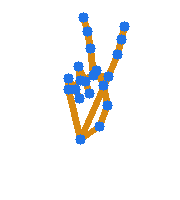

# Gesture recognition

Gesture recognition is a topic in computer science and language technology with the goal of interpreting human gestures via mathematical algorithms. It is a subdiscipline of computer vision. Gestures can originate from any bodily motion or state, but commonly originate from the face or hand.

NXP developed own gesture recognition library that provides access to the following features:

1. Hand detection
2. Hand landmark detection - optimized Google Hand landmark model
3. Gesture recognition

All models are quantized using NXP's NanoAI technology and are optimized for the ARMv7-CortexM7. The memory footprint is as follow:

- text memory - 1.26MB
- RAM - 1.48MB + (height * width * 3)

The Smart Panel application uses by default the Gesture recognition library found under
cm7/libs/uvita_gesture/libuvita_gesture_cm7.a. The gesture recognition can be disabled by commenting the ENABLE_VISIONALGO_DEV_Uvita_Gesture from board_define.h.

## Uvita Gesture Recognition setup

In the current .c/.cpp working file include "uvita_gesture.h"
To setup the gesture recognition, it is necessary to initialize it by calling uvita_gesture_init.
For proper initialization, parameters need to set beforehand.

### 1. input_height/input_wdith

Maximum height and width of the input frame.

### 2. mem_size

In order to get the right memory size needed by the library, call uvita_gesture_get_buf_size(height, width) where height and width are maximum input frames

### 3. mem_pool

Memory pool allocated having the size mentioned in the mem_size field

### 4. fast_mem_size / fast_mem_pool

Uvita library is optimized to store and maintain often used variable inside a fast memory. Depending on the type of memory provided here, performance can be improved considerably. For M7 core allocate this memory pool inside DTCM for best results.

```{Warning}
In order to obtain considerable improvements, fast_mem_size should be at least 32KB.
```

```c
void Init(void)
{
    /* memory configuration */
    init_para.mem_pool = NULL;
    init_para.mem_size = uvita_gesture_get_buf_size(UVITA_FULL_FRAME_H, UVITA_FULL_FRAME_W);
    PRINTF("uvita requires memory size: %d\r\n", init_para.mem_size);

    char* mempool = (char*)pvPortMalloc(init_para.mem_size);
    if (mempool == NULL) {
        PRINTF("uvita malloc error\r\n");
    }

    init_para.mem_pool      = mempool;
    init_para.fast_mem_size = DTC_OPTIMIZE_BUFFER_SIZE;
    init_para.fast_mem_pool = s_DTCOPBuf;

    /* uvita initialization */
    ret = uvita_gesture_init(&init_para);
    if (ret != UVITA_SUCCESS) {
        PRINTF("uvita initialization error: %d\r\n", ret);
    }
}
```

## Uvita Gesture Recognition usage

After the setup stage, we can provide frames to the inference engine in order to get the results.
Uvita library run function is uvita_gesture_run. As mentioned before, the library will perform 3 types of operation.

Hand detection is done over the det_frame provided as second parameter of the run function (det_frame).
The buffer should be a low resolution image, of recommend size 192*256, situated in a fast memory area.

If the hand has been found in the det_frame, the algorithm will move forward to step 2 and 3. This operations are done on high resolution image for better distance recognition and higher accuracy.
The library places 21 hand markers and recognizes up to 13 gestures:

```c
typedef enum
{
    GESTURE_OK = 0,
    GESTURE_FIST,
    GESTURE_ONE,
    GESTURE_VICTORY,
    GESTURE_THREE,
    GESTURE_FOUR,
    GESTURE_PALM,
    GESTURE_THUMB_UP,
    GESTURE_PINKY_UP,
    GESTURE_ROCK_ROLL,
    GESTURE_CALL_ME,
    GESTURE_PREVIOUS,
    GESTURE_NEXT,
    GESTURE_NONE
} gesture_type;
```

The inference results, are returned via the 3 parameter of the run function *hout.
The structure contains information about hand presence, hand position, hand identification, hand gesture, hand landmarkers:

```c
typedef struct
{
    bool has_hand;                            /**< whether the hand is detected or not; */
    DetBox_t box;                             /**< hand location: left, top, right, bottom. */
    float conf;                               /**< hand confidence. */
    hand_lr left_right;                       /**< left hand or right hand. */
    gesture_type gtype;                       /**< gesture type. */
    float handmark[HAND_LANDMARK_NUMBER * 3]; /**< hand landmark location: x1, y1, z1, x2, y2, z2... */
} uvita_gesture_out;
```

For more information regarding hand markers check [Google Media Pipe](https://developers.google.com/mediapipe/solutions/vision/hand_landmarker)

<!---  -->

<title>Hand mark output</title>
<image href="./../img/HandMarks.png">
</image></fig>
