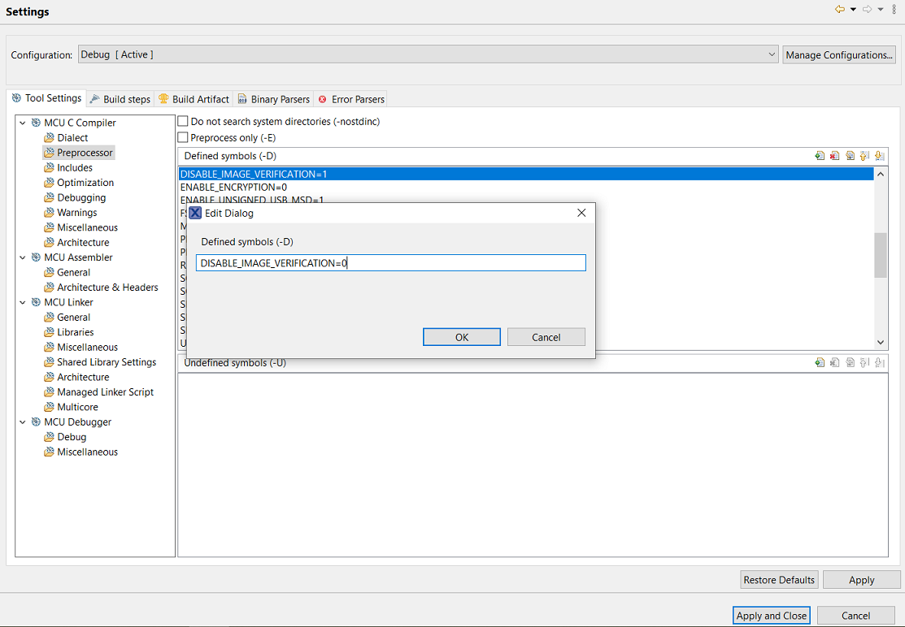

[enable_image_verification]: ../../img/bootloader/bootloader_EnableImageVerification.png "Enable Image Verification"

# Normal boot

By default, if no other boot flags are set during the boot phase, the Normal boot mode is used.
During Normal boot, the Bootloader boots to the "main" application, which is flashed at the current application bank flash address (see Application Banks for more information).
For example, if the current flash bank is set to Bank A, then the Bootloader jumps to the flash address associated with Bank A and begins running the application at that address.

The OOBE has a set of three applications that can be booted into at startup.
By default, the application always boots in the `Bank A`, which corresponds to `coffee_machine app`.
To change the boot application, use buttons labeled `SW1-SW3` when powering the board.

The following list shows the associations of boot application to switch.

- `SW1` - Bank A - coffee_machine
- `SW2` - Bank B - elevator
- `SW3` - Bank C - TBD

The decision to what application to jump is handled inside the bootloader.
To reach the bootloader, a soft or hard reset is needed.

For example, to boot in elevator application:

1. Unplug the board
2. Press and hold SW2 button
3. Plug the board in.

From the Bootloader's perspective, there is no information what application it is jumping into,
because it uses addresses and not names.
After an update procedure, the application that was written in an inactive bank is overwritten, so the links between banks and demos are not valid anymore.

## Turn on image Verification

In the OOBE Bootloader demo, Image Verification is disabled to encourage developers to play with the code.
If Image Verification is enabled, Normal boot checks that the image certificate for the firmware image to run has been signed by a trusted certificate authority to ensure that the application comes from a trusted source.
Should the signature check fail, the Bootloader does not run the application to avoid executing untrusted, potentially malicious firmware.

For more details regarding image verification, see Image Verification in the "security/image_verification.md" file.

To enable the image verification, “DISABLE_IMAGE_VERIFICATION” must be set to 0 inside the <b>Preprocessors</b> sections:

1. Within the MCUXpresso Bootloader project, right-click the root project and navigate to <b>Properties > C/C++ Build > Settings > Preprocessor </b>.
2. Inside the <b>Preprocessors</b> section, change the MACRO <b>“DISABLE_IMAGE_VERIFICATION”</b> to “0” and click the <b>Apply and Close</b> button as describe in [Figure](#enable_image_verification)




3. After that change, rebuild the Bootloader.
4. To flash the device with proper FICA and certificates, use the automated manufacturing tool 'Ivaldi' (refer to "security/ivaldi.md")

## Disable Debug Console

In the OOBE Bootloader demo, Debug Console is enabled to help developers test and debug their code.
This feature introduces unwanted message being displayed and increases the boot-up time.
To disable this, set `ENABLE_LOGGING` to 0 in "FreeRTOSConfig.h"

```{note}
Current implementation of the debug console adds about 150 ms in boot time.
```