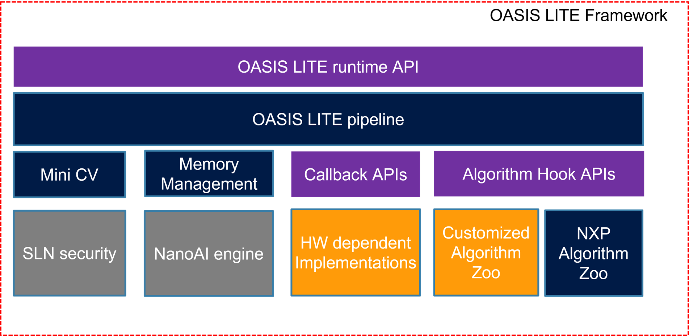

# Oasis Lite Runtime Library

OASIS LITE runtime Library is a tiny, highly efficient, customized and optimized AI library, which includes mini CV, fast speed and optimized inference engine--NanoAI for NXP MCU, and memory management unit. Additionally, there are some AI models( customized for NXP MCUs) embedded in this library. They are face detection, face recognition, front face detection, glass detection, and liveness detection based on RGB or IR images. It is an ideal runtime library for some applications such as entry access control products based on faces identification.



## Usage

## 

### Initializing

In Initializing procedure, OASISLT_init should be the first API called before any other APIs and caller need provide:

- Input image frame format. It should include image type and maximum height/width in pixels, generally these numbers are equal  to the resolution of camera you are using. And image type you can find in _OASISLTImageType_t_.
- Minimum face size can be detected in pixel, minimum face size in subsequent calling of OASISLT_run_extend can be larger or equal this value but must not less than this value. **For better results this value should not less than 100.**
- Recommend OASISLT_init be called twice, in the first call of OASISLT_init, all other parameters should be filled except _memPool_ as NULL and _size_ as zero , by this way, when return, memory size actual needed is in _size_ field. Caller can allocate memory according the _size_ and call OASISLT_init again.
- Fast memory is specifically designed for enhance performance oasis library internal, this buffer will be used by Nano AI inference engine with critical code. This buffer should only be used by inference engine inside. Oasis library considers NULL as disabled value for fast memory feature, suggest (32\*1024) or (64\*1024) or (128\*1024).
- OASIS LITE using callback functions to interact with the user, the results of the algorithm during its execution will be presented in the callback function.

```c
OASISLTResult_t OASISLT_init(OASISLTInitPara_t* para);
```

### Scheduling

In procedure of OASISLT_run_extend, it always communicate with the caller by callback functions provided in OASISLT_init parameters. What OASISLT_run_extend does is related to run flags input, refer to API _run and flags_ chapter for more information.

- Detection start/complete events: they are always triggered after this calling. Caller can get face position information (left top and right bottom points of face box and 5 points landmarks, detial landmark  you can find in **Landmark index chapter**).
- Face quality check start/complete events: only be triggered when any face is detected.
- Face recognition start/complete events: is triggered when a face recognition start/complete. If no face is detected or detected face is not qualified, the caller does not receive these events.
- Registration start/complete event: when a new face registration procedure is started/complete. Be triggered when a duplicate face, registration successfully or face data operation failed.

```c
int OASISLT_run_extend(ImageFrame_t* frames[OASISLT_INT_FRAME_IDX_LAST], uint8_t flag, int minFace, void* userData);
```

### Uninitializing

OASISLT_uninit().

```c
OASISLTResult_t OASISLT_uninit();
```

## Pipeline

There are four kinds of main pipeline internal oasis. Caller can free to use it at runtime.

### Face detect

OASISLT_run_extend with OASIS_DET_ONLY run flag can generated face detect box result. User can get box information in _para->faeBoxIR_ and _para->faceBoxRGB_ at callback event.

```c
int ret = OASISLT_run_extend(pframes, OASIS_DET_ONLY, min_face, puser_data);
```

```c
void _oasis_evtCb(ImageFrame_t *frames[], OASISLTEvt_t evt, OASISLTCbPara_t *para, void *userData)
{
    switch (evt)
    {
        case OASISLT_EVT_DET_START:
        {
            /* reset result*/
        }
        break;
        case OASISLT_EVT_DET_COMPLETE:
        {
            /*update face detect result*/
        }
        break;
    }
}
```

### Face quality

OASISLT_run_extend with OASIS_DET_WITH_QUALITY_CHECK run flag can generated face quality check result. User can get quality result in _para->qualityResult_ at callback event _._ It should also include face detect process, because some of quality check is base face detect result.

```c
int ret = OASISLT_run_extend(pframes, OASIS_DET_WITH_QUALITY_CHECK, min_face, puser_data);
```

```c
void _oasis_evtCb(ImageFrame_t *frames[], OASISLTEvt_t evt, OASISLTCbPara_t *para, void *userData)
{
    switch (evt)
    {
        case OASISLT_EVT_QUALITY_CHK_START:
        {
            /* reset result*/
        }
        break;

        case OASISLT_EVT_QUALITY_CHK_COMPLETE:
        {
            /*update face quality result*/
        }
        break;
    }
}
```

### Face recognition

OASISLT_run_extend with OASIS_DET_REC run flag can generated face recognition result. User can get result in _para->recResult_ at callback event. Face recognition should pass face detect and quality check first, then user will get the face id in database when OASIS LITE recognized know user. Unknown people recognized mean can not find in database.

```c
int ret = OASISLT_run_extend(pframes, OASIS_DET_REC, min_face, puser_data);
```

```c
void _oasis_evtCb(ImageFrame_t *frames[], OASISLTEvt_t evt, OASISLTCbPara_t *para, void *userData)
{
    switch (evt)
    {
        case OASISLT_EVT_REC_START:
        {
            /* reset result*/
        }
        break;

        case OASISLT_EVT_REC_COMPLETE:
        {
            /*update face recognition result*/
        }
        break;
    }
}
```

### Face registration

OASISLT_run_extend with OASIS_DET_REC_REG run flag can generated face registration result. User can get face registration result in _para->regResult_ at callback event. Face registration is different with face recognition, it should add face in database with corresponding strategy.

```c
int ret = OASISLT_run_extend(pframes, OASIS_DET_REC_REG, min_face, puser_data);
```

```c
void _oasis_evtCb(ImageFrame_t *frames[], OASISLTEvt_t evt, OASISLTCbPara_t *para, void *userData)
{
    switch (evt)
    {
        case OASISLT_EVT_REG_START:
        {
            /* reset result*/
        }
        break;

        case OASISLT_EVT_REG_COMPLETE:
        {
            /*update face registration result*/
        }
        break;
    }
}
```

## Example

### Initialization

```c
OASISLTInitPara_t   s_oasisInitParam;
memset(&s_oasisInitParam, 0x00, sizeof(OASISLTInitPara_t));

// init the oasis config
s_oasisInitParam.imgType                     = OASIS_IMG_TYPE_IR_RGB_DUAL;
s_oasisInitParam.minFace                     = 100;
s_oasisInitParam.enableFlags                 = 0;
s_oasisInitParam.falseAcceptRate             = OASIS_FAR_1_1000000;
s_oasisInitParam.height                      = OASIS_RGB_FRAME_HEIGHT;
s_oasisInitParam.width                       = OASIS_RGB_FRAME_WIDTH;
s_oasisInitParam.size                        = 0;
s_oasisInitParam.memPool                     = NULL;
s_oasisInitParam.fastMemSize                 = OASIS_FAST_MEMORY_BUF;
s_oasisInitParam.fastMemBuf                  = (char *)malloc(OASIS_FAST_MEMORY_BUF);
if (s_oasisInitParam.fastMemBuf == NULL)
{
    return kAlgo_status_MemPool;
}

s_oasisInitParam.cbs.EvtCb            = _oasis_evtCb;
s_oasisInitParam.cbs.GetFaces         = _oasis_getFace;
s_oasisInitParam.cbs.AddFace          = _oasis_addFace;
s_oasisInitParam.cbs.UpdateFace       = _oasis_updFace;
s_oasisInitParam.cbs.DeleteFace       = _oasis_delFace;
s_oasisInitParam.cbs.AdjustBrightness = _oasis_adjustBrightness;
s_oasisInitParam.cbs.reserved         = (void *)_oasis_log;

OASISLTResult_t ret = OASISLT_init(&s_oasisInitParam);
if (ret == OASIS_INIT_INVALID_MEMORYPOOL)
{
    s_oasisInitParam.memPool = (char *)malloc(s_oasisInitParam.size);
    if (s_oasisInitParam.memPool == NULL)
    {
        if (s_oasisInitParam.fastMemBuf != NULL)
        {
            free(s_oasisInitParam.fastMemBuf);
        }

        return kAlgo_status_MemPool;
    }

    ret = OASISLT_init(&s_oasisInitParam);
}
```

### Run

```c
ImageFrame_t        s_oasisFrames[OASISLT_INT_FRAME_IDX_LAST];
ImageFrame_t        *pOasisFrames[OASISLT_INT_FRAME_IDX_LAST];

s_oasisFrames[OASISLT_INT_FRAME_IDX_RGB].fmt      = OASIS_IMG_FORMAT_BGR888;
s_oasisFrames[OASISLT_INT_FRAME_IDX_RGB].height   = OASIS_RGB_FRAME_HEIGHT;
s_oasisFrames[OASISLT_INT_FRAME_IDX_RGB].width    = OASIS_RGB_FRAME_WIDTH;
s_oasisFrames[OASISLT_INT_FRAME_IDX_RGB].data     = NULL;
pOasisFrames[OASISLT_INT_FRAME_IDX_RGB]           = &s_oasisFrames[OASISLT_INT_FRAME_IDX_RGB];

s_oasisFrames[OASISLT_INT_FRAME_IDX_IR].fmt       = OASIS_IMG_FORMAT_BGR888;
s_oasisFrames[OASISLT_INT_FRAME_IDX_IR].height    = OASIS_IR_FRAME_HEIGHT;
s_oasisFrames[OASISLT_INT_FRAME_IDX_IR].width     = OASIS_IR_FRAME_WIDTH;
s_oasisFrames[OASISLT_INT_FRAME_IDX_IR].data      = NULL;
pOasisFrames[OASISLT_INT_FRAME_IDX_IR] = &s_oasisFrames[OASISLT_INT_FRAME_IDX_IR];

while(1)
{

    pOasisFrames[OASISLT_INT_FRAME_IDX_RGB]->data = pFrame[0];
    pOasisFrames[OASISLT_INT_FRAME_IDX_IR]->data  = pFrame[1];

    int oasisRet = OASISLT_run_extend(pOasisFrames, oasis_run_flag, 100, &s_oasisInitParam);
}
```

### Event callback

```c
void _oasis_evtCb(ImageFrame_t *frames[], OASISLTEvt_t evt, OASISLTCbPara_t *para, void *userData)
{
    switch (evt)
    {
        case OASISLT_EVT_DET_START:
        {

        }
        break;

        case OASISLT_EVT_DET_COMPLETE:
        {
            if (para->faceBoxRGB == NULL && para->faceBoxIR == NULL)
            {
                LOGD("[OASIS] DET:No face detected\r\n");
            }
            else
            {
                if (para->faceBoxRGB != NULL)
                {
                    LOGD("[OASIS] DET:[Left: %d, Top: %d, Right: %d, Bottom: %d]\r\n", para->faceBoxRGB->rect[0],
                        para->faceBoxRGB->rect[1], para->faceBoxRGB->rect[2], para->faceBoxRGB->rect[3]);
                }

                if (para->faceBoxIR != NULL)
                {
                    LOGD("[OASIS] DET:[Left: %d, Top: %d, Right: %d, Bottom: %d]\r\n", para->faceBoxIR->rect[0],
                        para->faceBoxIR->rect[1], para->faceBoxIR->rect[2], para->faceBoxIR->rect[3]);
                }
            }
        }
        break;

        case OASISLT_EVT_QUALITY_CHK_START:
        break;

        case OASISLT_EVT_QUALITY_CHK_COMPLETE:
        {
            switch (para->qualityResult)
            {
                case OASIS_QUALITY_RESULT_FACE_OK:
                {
                    LOGD("[OASIS] Quality:ok. \r\n");
                }
                break;

                case OASIS_QUALITY_RESULT_FACE_TOO_SMALL:
                {
                    LOGD("[OASIS] Quality:Small Face\r\n");
                }
                break;

                case OASIS_QUALITY_RESULT_FAIL_BRIGHTNESS_DARK:
                case OASIS_QUALITY_RESULT_FAIL_BRIGHTNESS_OVEREXPOSURE:
                {
                    LOGD("[OASIS] Quality:Face Brightness\r\n");
                break;

                case OASIS_QUALITY_RESULT_FACE_BLUR:
                {
                    LOGD("[OASIS] Quality:Blurry Face\r\n");
                }
                break;

                case OASIS_QUALITY_RESULT_FACE_ORIENTATION_UNMATCH:
                {
                    LOGD("[OASIS] Quality:Side face\r\n");
                }
                break;

                case OASIS_QUALITY_RESULT_PARTIAL_BRIGHTNESS_FAIL:
                {

                }
                break;

                case OASIS_QUALITY_RESULT_RGB_FAKE:
                {
                    LOGD("[OASIS] Quality:rgb fake\r\n");
                }
                break;

                case OASIS_QUALITY_RESULT_IR_FAKE:
                {
                    LOGD("[OASIS] Quality:ir fake\r\n");
                }
                break;

                default:
                    break;
            }
        }
        break;

        case OASISLT_EVT_REC_START:
        break;

        case OASISLT_EVT_REC_COMPLETE:
        {
            if (para->recResult == OASIS_REC_RESULT_KNOWN_FACE)
            {
                LOGD("[OASIS] KNOWN_FACE\r\n")
            }
            else if (para->recResult == OASIS_REC_RESULT_UNKNOWN_FACE)
            {
                LOGD("[OASIS] UNKNOWN_FACE\r\n");
            }
            else
            {
                LOGD("[OASIS] INVALID_FACE\r\n");
            }
        }
        break;

        case OASISLT_EVT_REG_START:
        break;

        case OASISLT_EVT_REG_IN_PROGRESS:
        break;

        case OASISLT_EVT_REG_COMPLETE:
        {
            if (para->regResult == OASIS_REG_RESULT_OK)
            {
                LOGD("[OASIS] REGISTRATION SUCCESS id:[%d]\r\n", para->faceID);
            }
            else if (para->regResult == OASIS_REG_RESULT_DUP)
            {
                LOGD("[OASIS] REGISTRATION DUPLICATED id:%d\r\n", para->faceID);
            }
        }
        break;

        default:
        break;
    }
}
```

# Release and Delivery

The OASIS LITE runtime library is released in static C library format with C header files. We have different library for different platform and configurations.

**Note: version 2.x.x is specially for tlhmi project, and this doc is for tlhmi project.**

Supported architectures:

- RT106F and RT117F for bare system or RTOS.
- ARM cortex A core on Android platform.
- X86 64bit on Linux platform.
- X86 64bit on Windows platform.

# OASIS LITE runtime API

## Version Information

| **Name**       | **Type** | **Description**          |
| -------------- | -------- | ------------------------ |
| VERSION_MAJOR  | int      | The major version number |
| VERSION_MINOR  | int      | The minor version number |
| VERSION_HOTFIX | int      | Hot fix version number   |

## Result enumerations

These enumerations are used as return of OASIS LITE APIs and indicate the meaning of result.

| **Name**                                  | **Bit index** | **Description**                                                              |
| ----------------------------------------- | ------------- | ---------------------------------------------------------------------------- |
| OASISLT_OK                                | 0             | Result is successful.                                                        |
| OASIS_INIT_INVALID_PARAMETERS             | 1             | Invalid input parameters.                                                    |
| OASIS_INIT_INVALID_MODEL_CLASS            | 2             | Invalid input model class.                                                   |
| OASIS_INIT_ALREADY_INIT                   | 3             | OASIS library already initialized.                                           |
| OASIS_INIT_INVALID_FAR                    | 4             | Invalid false accept rate parameter.                                         |
| OASIS_INIT_INVALID_CB                     | 5             | Invalid callback parameter.                                                  |
| OASIS_INIT_MEMORYPOOL_SMALL               | 6             | Input memory pool is too small.                                              |
| OASIS_INIT_INVALID_MEMORYPOOL             | 7             | Input memory pool is NULL.                                                   |
| OASIS_INIT_INVALID_IMAGE_MIN_DIM          | 8             | Invalid input frame height/width.                                            |
| OASIS_INIT_INVALID_MASK_BUF               | 9             | Invalid buffer size found for mask face recognition.                         |
| OASIS_INIT_INVALID_IMG_TYPE_FOR_MASK_FACE | 10            | Image type is not supported for mask face recognition.                       |
| OASIS_INIT_MASK_REC_NOTSUPORTED           | 11            | Mask face recognition is not supported in this library.                      |
| OASIS_INIT_INVALID_IMAGE_TYPE             | 12            | Invalid image type parameter.                                                |
| OASIS_INIT_INSTANCE_NUM_OVERFLOW          | 13            | Instance number overflow/underflow.                                          |
| OASIS_INIT_AUTHENTICATION_FAIL            | 14            | Authentication failed.                                                       |
| OASIS_INIT_MEM_ALLOCATE_FAIL              | 15            | Memory allocation error during initializing.                                 |
| OASISLT_SNAPSHOT_INVALID_INPUT_PARAMETERS | 16            | Invalid input parameter in  OASISlT_snapshot2Feature.                        |
| OASISLT_SNAPSHOT_LIB_UNINIT               | 17            | OASIS LITE library uninitialized before calling of OASISlT_snapshot2Feature. |
| OASISLT_SNAPSHOT_INVALID_FRAME_NUM        | 18            | In function OASISlT_snapshot2Feature, frame number unmatched.                |
| OASISLT_SNAPSHOT_IMG_TYPE_NOT_SUPPORT     | 19            | In function OASISlT_snapshot2Feature, wrong image type.                      |
| OASISLT_SNAPSHOT_RESIZE_FAILED            | 20            | In function OASISlT_snapshot2Feature, snapshot resize error.                 |
| OASIS_INIT_INVALID_FASTMEMORYBUFFER       | 21            | OASIS LITE library fast buffer initialized error.                            |

## Run mode flag

This flag is used in OASISLT_run_extend function, it indicates what jobs is going to execute on the current input frame data.

| **Name**                     | **Type** | **Value** | **Description**                                                        |
| ---------------------------- | -------- | --------- | ---------------------------------------------------------------------- |
| OASIS_DET_ONLY               | Uint8_t  | 0         | Do face detection only.                                                |
| OASIS_DET_WITH_QUALITY_CHECK | Uint8_t  | 1         | Do face detection with face quality check.                             |
| OASIS_DET_REC                | Uint8_t  | 2         | Do face detection, quality check and face recognition.                 |
| OASIS_DET_REC_REG            | Uint8_t  | 3         | Do face detection, quality check, face recognition and registration.   |
| OASIS_DET_REC_DEREG          | Uint8_t  | 4         | Do face detection, quality check, face recognition and deregistration. |

## Recognition result

| **Name**                     | **Type** | **Value** | **Description**                  |
| ---------------------------- | -------- | --------- | -------------------------------- |
| OASIS_REC_RESULT_KNOW_FACE   | Uint8_t  | 0         | A matched face is found.         |
| OASIS_REC_RESULT_UNKNOW_FACE | Uint8_t  | 1         | No face matched.                 |
| OASIS_REC_RESULT_INVALID     | Uint8_t  | 0xFF      | Invalid face recognition result. |

## Registration result

This value indicate the result of face registration. User can get this value from parameters of face registration complete event.Face quality result.

| **Name**                      | **Type** | **Value** | **Description**                                                |
| ----------------------------- | -------- | --------- | -------------------------------------------------------------- |
| OASIS_REG_RESULT_OK           | Uint8_t  | 0         | Face registration success.                                     |
| OASIS_REG_RESULT_DUP          | Uint8_t  | 1         | Face registration failed, this face has been registered in DB. |
| OASIS_REG_RESULT_CANCELED     | Uint8_t  | 2         | Face registration has been cancelled by caller.                |
| OASIS_REG_RESULT_DB_OP_FAILED | Uint8_t  | 3         | Face registration failed because of database operation failed. |
| OASIS_REG_RESULT_INVALID      | Uint8_t  | 0xFF      | Failed with unknown reason                                     |

## Face quality result

Face quality result value list, these values will be returned in face quality check complete event notification.

| **Name**                                          | **Type** | **Value** | **Description**                                                           |
| ------------------------------------------------- | -------- | --------- | ------------------------------------------------------------------------- |
| OASIS_QUALITY_RESULT_FACE_OK                      | Uint8_t  | 0         | Face quality is fine for recognition/registration. For internal use only. |
| OASIS_QUALITY_RESULT_FACE_TOO_SMALL               | Uint8_t  | 1         | Face area is too small for recognition/registration.                      |
| OASIS_QUALITY_RESULT_FACE_ORIENTATION_UNMATCH     | Uint8_t  | 2         | Face posture is side face.                                                |
| OASIS_QUALITY_RESULT_FACE_BLUR                    | Uint8_t  | 3         | Face image is blur.                                                       |
| OASIS_QUALITY_RESULT_IR_FAKE                      | Uint8_t  | 4         | Face detected in IR image is fake.                                        |
| OASIS_QUALITY_RESULT_RGB_FAKE                     | Uint8_t  | 5         | Face detected in RGB image is fake.                                       |
| OASIS_QUALITY_RESULT_2D_FAKE                      | Uint8_t  | 6         | Not used.                                                                 |
| OASIS_QUALITY_RESULT_3D_FAKE                      | Uint8_t  | 7         | Not used.                                                                 |
| OASIS_QUALITY_RESULT_DEPTH_INVALID                | Uint8_t  | 8         | Not used.                                                                 |
| OASIS_QUALITY_RESULT_FAIL_BRIGHTNESS_DARK         | Uint8_t  | 9         | Face used for recognition is too dark.                                    |
| OASIS_QUALITY_RESULT_FAIL_BRIGHTNESS_OVEREXPOSURE | Uint8_t  | 10        | Face used for recognition is over exposure.                               |
| OASIS_QUALITY_RESULT_FAIL_BRIGHTNESS_BLOCKFAIL    | Uint8_t  | 11        | Face used for recognition is block brightness not pass.                   |
| OASIS_QUALITY_RESULT_FACE_WITH_MASK               | Uint8_t  | 12        | Not used.                                                                 |
| OASIS_QUALITY_RESULT_PARTIAL_BRIGHTNESS_FAIL      | Uint8_t  | 13        | Face used for recognition is partial brightness not pass.                 |
| OASIS_QUALITY_RESULT_MALLOC_ERROR                 | Uint8_t  | 14        | Memory malloc error.                                                      |
| OASIS_QUALITY_RESULT_INVALID                      | Uint8_t  | 0xFF      | Unknown result.                                                           |

## Glasses check result

These values indicate whether a detected face is wearing a glasses or not.

| **Name**                                        | **Type** | **Value** | **Description**               |
| ----------------------------------------------- | -------- | --------- | ----------------------------- |
| OASIS_GLASSES_CHECK_RESULT_FACE_WITHOUT_GLASSES | Uint8_t  | 0         | Detected face without glasses |
| OASIS_GLASSES_CHECK_RESULT_FACE_WITH_GLASSES    | Uint8_t  | 1         | Detected face with glasses    |
| OASIS_GLASSES_CHECK_RESULT_INVALID              | Uint8_t  | 2         | Unknown                       |

## Mask check result

These values indicate whether detected face is wearing a mask or not.(Not support)

| **Name**                                  | **Type** | **Value** | **Description**            |
| ----------------------------------------- | -------- | --------- | -------------------------- |
| OASIS_MASK_CHECK_RESULT_FACE_WITHOUT_MASK | Uint8_t  | 0         | Detected face without mask |
| OASIS_MASK_CHECK_RESULT_FACE_WITH_MASK    | Uint8_t  | 1         | Detected face with mask    |
| OASIS_MASK_CHECK_RESULT_INVALID           | Uint8_t  | 2         | Unknown                    |

## FAR values

These values indicate what false accept rate can be acceptable in face recognition procedure. A lower FAR means a higher TRR(true rejection rate).

| **Name**            | **Type** | **Value** | **Description**   |
| ------------------- | -------- | --------- | ----------------- |
| OASIS_FAR_1_10000   | Uint8_t  | 0         | one 10000th FAR   |
| OASIS_FAR_1_100000  | Uint8_t  | 1         | one 100000th FAR  |
| OASIS_FAR_1_1000000 | Uint8_t  | 2         | one 1000000th FAR |

## Model class

This flag indicates which model is going to be used in face recognition. Heavy model means a higher accuracy and more time cost for one face recognition.

| **Name**                  | **Type** | **Value** | **Description**                 |
| ------------------------- | -------- | --------- | ------------------------------- |
| OASISLT_MODEL_CLASS_LIGHT | Uint8_t  | 0         | A light face recognition model  |
| OASISLT_MODEL_CLASS_HEAVY | Uint8_t  | 1         | A heavy face recognition model. |

## Image formats

This value indicate color format, bits for each color and their storage sequence in memory. For all images, we assume pixel format is HWC.

| **Name**                 | **Type** | **Value** | **Description**                                                                                                 |
| ------------------------ | -------- | --------- | --------------------------------------------------------------------------------------------------------------- |
| OASIS_IMG_FORMAT_RGB888  | Uint8_t  | 0         | 3 bytes for each pixel, 8 bits for each color(Red, Green, and Blue) and storage sequence is red, green and blue |
| OASIS_IMG_FORMAT_BGR888  | Uint8_t  | 1         | Same as above but the storage sequence is blue, green and red.                                                  |
| OASIS_IMG_FORMAT_GREY888 | Uint8_t  | 2         | 3 bytes for each pixel and they are same. For internal use only                                                 |
| OASIS_IMG_FORMAT_GREY8   | Uint8_t  | 3         | 1 bytes for each pixel and this byte is grey value. For internal use only                                       |

## Image types

These values indicate input image stream configuration to OASIS library. It indicates what type of frames input and handled by OASISLT_run_extend API.

| **Name**                        | **Type** | **Value** | **Description**                                                                  |
| ------------------------------- | -------- | --------- | -------------------------------------------------------------------------------- |
| OASIS_IMG_TYPE_RGB_SINGLE       | Uint8_t  | 0         | Single RGB image stream                                                          |
| OASIS_IMG_TYPE_IR_SINGLE        | Uint8_t  | 1         | Single IR image stream                                                           |
| OASIS_IMG_TYPE_IR_RGB_DUAL      | Uint8_t  | 2         | Both IR and RGB image stream. Do face recognition on IR image.                   |
| OASIS_IMG_TYPE_RGB_IR_DUAL      | Uint8_t  | 3         | Both IR and RGB image stream. Do face recognition on RGB image.                  |
| OASIS_IMG_TYPE_IR_RGB_3D_TRIPLE | Uint8_t  | 4         | IR,RGB,3D images are all input. Do face recognition on IR image. Not supported.  |
| OASIS_IMG_TYPE_RGB_IR_3D_TRIPLE | Uint8_t  | 5         | IR,RGB,3D images are all input. Do face recognition on RGB image. Not supported. |

## Frame index

These indexes are used to differentiate IR,RGB and 3D frames.

| **Name**                   | **Type** | **Value** | **Description**    |
| -------------------------- | -------- | --------- | ------------------ |
| OASISLT_INT_FRAME_IDX_RGB  | Uint8_t  | 0         | RGB frame index    |
| OASISLT_INT_FRAME_IDX_IR   | Uint8_t  | 1         | IR frame index     |
| OASISLT_INT_FRAME_IDX_3D   | Uint8_t  | 2         | 3D frame index     |
| OASISLT_INT_FRAME_IDX_LAST | Uint8_t  | 3         | Frame index number |

## Landmark index

These indexes are used to indicate coordinate of 5 landmark on the detected face.

| **Name**                        | **Type** | **Value** | **Description**           |
| ------------------------------- | -------- | --------- | ------------------------- |
| OASISLT_LM_LEFT_EYE_X           | Uint8_t  | 0         | Left eye X                |
| OASISLT_LM_RIGHT_EYE_X          | Uint8_t  | 1         | Right eye x               |
| OASISLT_LM_NOSE_X               | Uint8_t  | 2         | Nose x                    |
| OASISLT_LM_MOUTH_LEFT_CORNER_X  | Uint8_t  | 3         | Mouth left corner x       |
| OASISLT_LM_MOUTH_RIGHT_CORNER_X | Uint8_t  | 4         | Mouth right corner x      |
| OASISLT_LM_LEFT_EYE_Y           | Uint8_t  | 5         | Left eye Y                |
| OASISLT_LM_RIGHT_EYE_Y          | Uint8_t  | 6         | Right eye Y               |
| OASISLT_LM_NOSE_Y               | Uint8_t  | 7         | Nose Y                    |
| OASISLT_LM_MOUTH_LEFT_CORNER_Y  | Uint8_t  | 8         | Mouth left corner Y       |
| OASISLT_LM_MOUTH_RIGHT_CORNER_Y | Uint8_t  | 9         | Mouth right corner Y      |
| OASISLT_LM_IDX_NUM              | Uint8_t  | 10        | All landmark index number |

## Face Box structure

Structure name: FBox, it indicates face ROI area and landmark information.

| **Name** | **Type**                     | **Description**                                       |
| -------- | ---------------------------- | ----------------------------------------------------- |
| rect     | Int\[4\]                     | The left, top, right, bottom of the face bounding box |
| fld      | Float\[ OASISLT_LM_IDX_NUM\] | The x, y coordinate of the 5 face landmark points     |

## Image frame structure

Structure name: ImageFrame_t.

| **Name** | **Type**             | **Description**                                                                                              |
| -------- | -------------------- | ------------------------------------------------------------------------------------------------------------ |
| height   | short                | Image height in pixel                                                                                        |
| width    | short                | Image width in pixel                                                                                         |
| fmt      | OASISLTImageFormat_t | indicate the format of this frame                                                                            |
| data     | Unsigned char\*      | Pointer of image data. Image data format is HWC format. Specially, for 3D frame, format is 16bits per pixel. |

## Event IDs

In procedure of OASISLT_run_extend, when a job(face detection/recognition, emotion recognition, face quality check and face registration) is started/completed or/and in progress, caller will be notified by an event callback function with a given event ID, this event list is as below.

| **Name**                         | **Type** | **Value** | **Description**                                |
| -------------------------------- | -------- | --------- | ---------------------------------------------- |
| OASISLT_EVT_DET_START            | Uint8_t  | 0         | Face detection start.                          |
| OASISLT_EVT_DET_COMPLETE         | Uint8_t  | 1         | Face detection complete.                       |
| OASISLT_EVT_QUALITY_CHK_START    | Uint8_t  | 2         | Face picture quality check start.              |
| OASISLT_EVT_QUALITY_CHK_COMPLETE | Uint8_t  | 3         | Face picture quality check complete.           |
| OASISLT_EVT_REC_START            | Uint8_t  | 4         | Face recognition start.                        |
| OASISLT_EVT_REC_COMPLETE         | Uint8_t  | 5         | Face recognition complete.                     |
| OASISLT_EVT_REG_START            | Uint8_t  | 6         | Face registration start.                       |
| OASISLT_EVT_REG_IN_PROGRESS      | Uint8_t  | 7         | Face registration procedure go forward a step. |
| OASISLT_EVT_REG_COMPLETE         | Uint8_t  | 8         | Face registration complete.                    |
| OASISLT_EVT_DEREG_START          | Uint8_t  | 9         | Face deregistration start.                     |
| OASISLT_EVT_DEREG_COMPLETE       | Uint8_t  | 10        | Face deregistration complete.                  |

## Event callback parameter structure

Structure name: OASISLTCbPara_t

| **Name**        | **Type**                     | **Description**                                                                                                                                                                                                                |
| --------------- | ---------------------------- | ------------------------------------------------------------------------------------------------------------------------------------------------------------------------------------------------------------------------------ |
| faceBoxIR       | FBox\*                       | Face box detected on IR image stream.NULL indicates that no face is detected.                                                                                                                                                  |
| faceBoxRGB      | FBox\*                       | Face box detected on RGB image stream.NULL indicates that no face is detected.                                                                                                                                                 |
| faceID          | Uint16_t                     | For Face recognition complete event callback, this ID indicates recognized face ID of pfaceBox.For Registration complete event callback, this ID is the new generated face ID for pfaceBox.For other event, faceID is invalid. |
| regResult       | OASISLTRegisterRes_t         | Result of registration. It is only valid when registration complete event happens.                                                                                                                                             |
| faceOrientation | OASISLTFaceOrientation_t     | Not used                                                                                                                                                                                                                       |
| deregResult     | OASISLTDeregisterRes_t       | Face deregistration result.                                                                                                                                                                                                    |
| qualityResult   | OASISLTFaceQualityRes_t      | Face quality result, only valid when   OASISLT_EVT_QUALITY_CHK_COMPLETE event happens.                                                                                                                                         |
| recResult       | OASISLTRecognizeRes_t        | Result of face recognition. Only valid when face recognition complete event happens.                                                                                                                                           |
| maskResult      | OASISLTFaceMaskCheckRes_t    | Result of mask detection.                                                                                                                                                                                                      |
| glassesResult   | OASISLTFaceGlassesCheckRes_t | Result of glasses detetion.                                                                                                                                                                                                    |
| reserved        | Uint32_t\[16\]               | This int array is reserved for internal debug purpose only.                                                                                                                                                                    |

## Event callback function

**Prototype**:

```c
typedef void (*OASISLTEvtCb)(ImageFrame_t* frames[OASISLT_INT_FRAME_IDX_LAST], OASISLTEvt_t evt, OASISLTCbPara_t* para, void* user_data);
```

**Description :**

In the process of OASISLT_run_extend, this callback function be triggered when each event in the event list happens. Frames is same to “frames” input parameter in OASISLT_run_extend.

| **Parameter Name** | **Input/output** | **Description**                                                                                     |
| ------------------ | ---------------- | --------------------------------------------------------------------------------------------------- |
| frames             | Input            | Current image frames on which all jobs is handling.                                                 |
| evt                | Input            | Event ID which triggers this callback.                                                              |
| para               | Input            | Other parameters which input to this callback, see _Event callback parameter structure_ for detail. |
| user_data          | Input            | User data pointer in calling of OASISLT_run_extend                                                  |

## Get registered faces function

**Prototype**:

```c
typedef int (*GetRegisteredFaces)(uint16_t* face_id, void** pfaces, uint32_t * face_num, void* userData);
```

**Description :**

This function should be implemented by the caller. By this interface, OASIS LITE runtime library can get all face information records (ID and feature pointers).

Return 0 if success, other value indicate a failure.

| **Parameter Name** | **Input/output** | **Description**                                                                                                                                                                                                                                                                                                                               |
| ------------------ | ---------------- | --------------------------------------------------------------------------------------------------------------------------------------------------------------------------------------------------------------------------------------------------------------------------------------------------------------------------------------------- |
| Face_id            | output           | It points to a uint16_t array buffer, this buffer is going to be used to save all face IDs returned. Each ID identified an unique face information record. The size of this buffer is allocated by OASIS lite library, it is   \*face_num X sizeof(uint16_t)                                                                                  |
| pfaces             | output           | It points to an array buffer which is used to save all pointers of face information record. Each record has a pointer and these pointers should be sync with ID array in face_id. OASIS lite library will use these pointers to read face features.Size of this buffer is: \*face_num X sizeof(void\*)                                        |
| Face_num           | Input/output     | For input, it indicate how many face ID and record pointers OASIS lite library requires. Specially, when it is set to 0 In this case, the actual face records number in database should be set to \*Face_num and face ID and pFace pointer array can be NULL.For output, it indicates how many face information records are returned in fact. |
| userData           | input            | User data pointer in calling of OASISLT_run_extend                                                                                                                                                                                                                                                                                            |

## Face add function

**Prototype**:

```c
typedef int (*FaceOperationAdd)( uint16_t* faceId, void* faceData, SnapshotItem_t* snapshotData, int snapshotNum, void* userData);
```

**Description :**

This function should be implemented by the caller. By this interface, OASIS LITE runtime library can add face information record to face record database. Face IDs are maintained by external database, each ID should be unique. When a record of face information is added successfully, a unique ID should be generated and returned to OASIS runtime library.

Snapshot usually is used to generate new face information record when current feature records can not be used because of library upgrading. Called may ignore this information if upgrading is not cared.

Return 0 if success, other value indicate a failure.

| **Parameter Name** | **Input/output** | **Description**                                                                                                                                             |
| ------------------ | ---------------- | ----------------------------------------------------------------------------------------------------------------------------------------------------------- |
| Face_id            | output           | Face ID generated for this face information record if adding successfully.                                                                                  |
| Face_data          | input            | Pointer to a face information record. It’s size can be get byOASISLT_getFaceItemSize()                                                                      |
| snapshotData       | input            | Snapshot packet associated with this face record. By this snapshot data, caller can generate face information record again by API OASISLT_snapshot2feature. |
| snapshotNum        | input            | Snapshot packet count                                                                                                                                       |
| userData           | input            | User data pointer in calling of OASISLT_run_extend                                                                                                          |

## Face update function (Not use)

**Prototype**:

```c
typedef int (*FaceOperationUpdate)(uint16_t faceId, void* faceData, SnapshotItem_t* snapshotData, int snapshotNum, void* userData);
```

**Description :**

This function should be implemented by the caller. By this interface, OASIS LITE runtime library can update face information record and corresponding snapshot data by face ID.

Return 0 if success, other value indicate a failure.

| **Parameter Name** | **Input/output** | **Description**                                                                        |
| ------------------ | ---------------- | -------------------------------------------------------------------------------------- |
| Face_id            | input            | face information record ID to be updated.                                              |
| Face_data          | input            | Pointer to a face information record. It’s size can be get byOASISLT_getFaceItemSize() |
| snapshotData       |                  | Part of Snapshot data associated with this face                                        |
| snapshotNum        |                  | Snapshot data count                                                                    |
| userData           |                  | User data pointer in calling of OASISLT_run_extend                                     |

## Face delete function

**Prototype:**

```c
typedef int (*FaceOperationDelete)(uint16_t faceId, void* userData);
```

**Description:**

This function should be implemented by the caller. By this interface, OASIS LITE runtime library can delete face information record and corresponding snapshot data by face ID.

Return 0 if success, other value indicate a failure.

## Brightness adjustment function

**Prototype**:

```c
typedef int (*FaceBrightnessAdjust)(uint8_t frame_idx,uint8_t direction,void* userData);
```

**Description :**

This function should be implemented by the caller. By this interface, OASIS LITE runtime library can adjust brightness on given image stream.

Return 0 if success, other value indicate a failure.

| **Parameter Name** | **Input/output** | **Description**                                                                            |
| ------------------ | ---------------- | ------------------------------------------------------------------------------------------ |
| Frame_idx          | input            | On which camera, brightness adjustment is needed.It can be one of RGB/IR/3D frame.         |
| direction          | input            | 0: adjust the brightness to a little darker.1: adjust the brightness to a little brighter. |

## Initializing parameter structure

**Description :**

Initializing parameter is the a parameter OASISLT_init need. It’s structure as below:

| **Parameter Name** | **Type** | **Description**                                                                                                                                                                                                                               |
| ------------------ | -------- | --------------------------------------------------------------------------------------------------------------------------------------------------------------------------------------------------------------------------------------------- |
| height             | input    | Maximum height of input images OASIS library can handle.It should not less than height of any frame input.                                                                                                                                    |
| width              | input    | Maximum width of input images OASIS library can handle.It should not less than width of any frame input                                                                                                                                       |
| imgType            | input    | Image stream type input to OASIS runtime library.This type indicates how many frames are input to OASIS_run_extend API once a time and it also indicate on which frame face recognition should be done. Refer to 4.13 for detail information. |
| minFace            | Input    | Minimum size of the face which can be detected. This size should less or equal to the value of “min_face” parameter for each call of OASISLT_run. Additionally, it should be >= 40.                                                           |
| memPool            | Input    | Memory pool can be used by OASIS library.If this parameter is NULL, OASISLT_init would return memory pool size required.                                                                                                                      |
| Size               | Input    | Memory pool size.                                                                                                                                                                                                                             |
| fastMemBuf         | Input    | Fast memory buffer supply for oasis library.                                                                                                                                                                                                  |
| fastMemSize        | Input    | Fast memory buffer size.                                                                                                                                                                                                                      |
| cbs                | Input    | Callback function set, which include:                                                                                                                                                                                                         |

1.Event callback function
2.Get registered faces function
3.Add face function
4.Update face function
5.Delete face function
6.Adjust brightness function
7.Reserved  (internal debugging use only) |

|
| enableFlags | Input | What functions are enabled in OASIS Library?Refer to chapter “function enable flags” |
| falseAcceptRate | Input | False accept rate caller required. |
| modClass | Input | Light or heavy model should be used for face recognition.Heavy model means a higher accuracy and more time cost.It is not valid for mask face recognition. |
| runtimePara | Input | This define customer’s all kind of algorithm threshold. Please don't configure it before you know the meaning of each parameter clearly. |

## Callback functions structure

**Description :**

This structure is used to set all callback functions needed during OASIS LITE runtime. It’s structure as below:

| **Parameter Name** | **Type**             | **Description**                                                                                                                                                                                                                                                                                                 |
| ------------------ | -------------------- | --------------------------------------------------------------------------------------------------------------------------------------------------------------------------------------------------------------------------------------------------------------------------------------------------------------- |
| EvtCb              | OASISLTEvtCb         | This callback function is called when any event start/complete inside library occurred.It can be NULL if caller does not care about any event.                                                                                                                                                                  |
| GetFaces           | GetRegisteredFaces   | By this function, library can get how many face are registered or get IDs and features of registered faces.It can not be NULL.                                                                                                                                                                                  |
| AddFace            | FaceOperationAdd     | By this function, library can save a face item record or snapshot to somewhere( it depend on caller, can be ram/disk). Caller can also save them to a temporary place instead of face DB and call OASISLT_registration_by_feature to add them to DB later at anytime. If is NULL, no face item should be saved. |
| UpdateFace         | FaceOperationUpdate  | By this function,library can update a face item. if is NULL, no update will be done. If face registration is done by remote (on PC or app on mobile phone), we strongly recommend to provide this callback.                                                                                                     |
| DeleteFace         | FaceOperationDelete  | By this function,library can delete a face item. if is NULL, no update will be done.                                                                                                                                                                                                                            |
| AdjustBrightness   | FaceBrightnessAdjust | If this function exist, library will call it to improve the image quality when darkness/over exposure are found on RGB and IR image.                                                                                                                                                                            |
| lock               | EnterCriticalArea    | This function is to used for multi-thread environment when multiple OASISLT_run_extend instances are running and some critical area need be protected such like memory allocation/free.                                                                                                                         |
| unlock             | ExitCriticalArea     | Same as above                                                                                                                                                                                                                                                                                                   |
| reserved           | Void\*               | Reserved for internal use only.                                                                                                                                                                                                                                                                                 |
